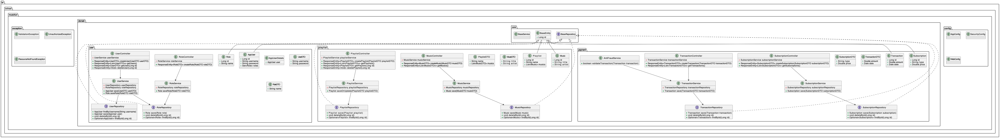
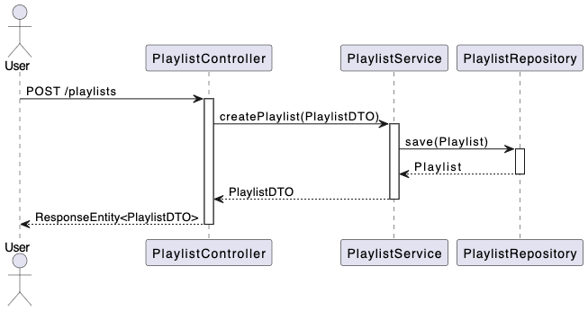

# MusicFun

Bem-vindo ao repositório do MusicFun, um sistema avançado de gerenciamento de música que integra funcionalidades de playlist, transações e assinaturas, desenvolvido com Spring Boot e seguindo os princípios de Domain-Driven Design e arquitetura limpa.

## Visão Geral

MusicFun é um aplicativo que permite aos usuários criar e gerenciar playlists, realizar transações seguras e assinar serviços de música. Este projeto foi meticulosamente construído com foco em práticas de código limpo, testabilidade e uma arquitetura robusta orientada ao domínio.

## Funcionalidades

- **Gerenciamento de Playlists**
- **Gestão de Músicas**
- **Transações**
- **Assinaturas de Serviços**
- **Controle de Acesso de Usuários**

## Tecnologias Utilizadas

- **Spring Boot**
- **Thymeleaf**
- **Spring Security**
- **JPA/Hibernate**
- **Maven**

## Endpoints da API

### UserController (`/users`)
- **GET `/users`**: Lista todos os usuários. Retorna um array de `UserDTO`.
- **GET `/users/{id}`**: Recupera um usuário específico pelo ID. Retorna `UserDTO`.
- **POST `/users`**: Cria um novo usuário. Recebe um `UserDTO` e retorna o `UserDTO` criado.
- **PUT `/users/{id}`**: Atualiza um usuário existente pelo ID. Recebe um `UserDTO` e retorna o `UserDTO` atualizado.
- **DELETE `/users/{id}`**: Exclui um usuário pelo ID. Retorna uma resposta sem conteúdo.

### SubscriptionController (`/subscriptions`)
- **GET `/subscriptions`**: Lista todas as assinaturas. Retorna um array de `SubscriptionDTO`.
- **GET `/subscriptions/{id}`**: Recupera uma assinatura específica pelo ID. Retorna `SubscriptionDTO`.
- **POST `/subscriptions`**: Cria uma nova assinatura. Recebe um `SubscriptionDTO` e retorna o `SubscriptionDTO` criado.
- **PUT `/subscriptions/{id}`**: Atualiza uma assinatura existente pelo ID. Recebe um `SubscriptionDTO` e retorna o `SubscriptionDTO` atualizado.
- **DELETE `/subscriptions/{id}`**: Exclui uma assinatura pelo ID. Retorna uma resposta sem conteúdo.

### TransactionController (`/transactions`)
- **GET `/transactions`**: Lista todas as transações. Retorna um array de `TransactionDTO`.
- **GET `/transactions/{id}`**: Recupera uma transação específica pelo ID. Retorna `TransactionDTO`.
- **POST `/transactions`**: Cria uma nova transação. Recebe um `TransactionDTO` e retorna o `TransactionDTO` criado.
- **PUT `/transactions/{id}`**: Atualiza uma transação existente pelo ID. Recebe um `TransactionDTO` e retorna o `TransactionDTO` atualizado.
- **DELETE `/transactions/{id}`**: Exclui uma transação pelo ID. Retorna uma resposta sem conteúdo.

### MusicController (`/music`)
- **GET `/music`**: Lista todas as músicas. Retorna um array de `MusicDTO`.
- **GET `/music/{id}`**: Recupera uma música específica pelo ID. Retorna `MusicDTO`.
- **POST `/music`**: Cria uma nova música. Recebe um `MusicDTO` e retorna o `MusicDTO` criado.
- **PUT `/music/{id}`**: Atualiza uma música existente pelo ID. Recebe um `MusicDTO` e retorna o `MusicDTO` atualizado.
- **DELETE `/music/{id}`**: Exclui uma música pelo ID. Retorna uma resposta sem conteúdo.

### PlaylistController (`/playlists`)
- **GET `/playlists`**: Lista todas as playlists. Retorna um array de `PlaylistDTO`.
- **GET `/playlists/{id}`**: Recupera uma playlist específica pelo ID. Retorna `PlaylistDTO`.
- **GET `/playlists/user`**: Lista playlists do usuário autenticado. Retorna um array de `PlaylistDTO`.
- **GET `/playlists/user/{username}`**: Lista playlists de um usuário específico pelo nome de usuário. Retorna um array de `PlaylistDTO`.
- **GET `/playlists/search`**: Busca playlists pelo nome. Retorna um array de `PlaylistDTO`.
- **POST `/playlists`**: Cria ou atualiza uma playlist. Recebe um `PlaylistDTO` e retorna o `PlaylistDTO` criado ou atualizado.
- **PUT `/playlists/{id}`**: Atualiza uma playlist existente pelo ID. Recebe um `PlaylistDTO` e retorna o `PlaylistDTO` atualizado.
- **DELETE `/playlists/{id}`**: Exclui uma playlist pelo ID. Retorna uma resposta sem conteúdo.
- **POST `/playlists/user/favorites`**: Adiciona músicas à playlist de favoritos do usuário autenticado. Recebe uma lista de `MusicDTO` e retorna o `PlaylistDTO` atualizado.

## Diagramas e Apresentação

### Diagrama de Classes

### Diagrama de Sequência

### Apresentação PDF
[Download da Apresentação](./docs/presentation.pdf)

